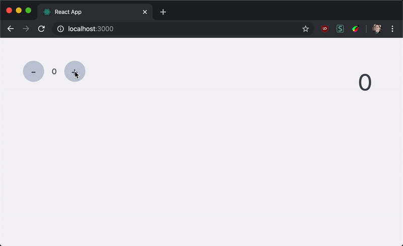

# Learn Advanced React: state management with context

We're going to learn how to manage global application state with React context.

## Learning outcomes

- [ ] Why we might want to avoid "prop drilling"
- [ ] Using context to access global state
- [ ] Centralising state updates with reducers
- [ ] Using custom hooks to create Redux-like abstractions

## Part 0: setup

1. Clone this repo
1. `cd` into it and run `npm install`
1. Run `npm start` and it should automatically open in your browser

You should see a counter that lets you increment and decrement a number. The app also displays a large copy of the count separately at the top right.



## Part 1: find the bug

Open `src/App.js`. It contains quite a few small components. Our `count` state has to live at the top-level component as it is needed in both branches of the component tree: inside `Counter` _and_ `BigCount`.

There's a bug in here somewhere: if you try the UI you should see that something doesn't work.

### Task

Find the bug and fix it so the counter works as expected.

## Prop drilling

Since there are several levels of nesting we have to pass our state down via props through multiple components. This is often called "prop drilling". It can be both annoying and a source of bugs, as we just discovered.

We can avoid doing this using React context.

## React context

Usually the only way for a component to use values from elsewhere in the component tree is if they are passed in as props. Context lets us bypass this and directly access values from further up the tree.

### Creating context

We can create a context like this:

```jsx
import React from "react";

const MyContext = React.createContext();
```

### Providing context

We now need to _provide_ a value to a component tree using this context. The context object contains a `.Provider` property, which is a component we can use to do this:

```jsx
import React from "react";

const MyContext = React.createContext();

function App() {
  return (
    <MyContext.Provider value={{ test: 5 }}>
      <Child />
    </MyContext.Provider>
  );
}
```

We pass whatever we want children to be able to access to the provider using its `value` prop.

### Accessing context

Any children within the provider can now access the context value using the `React.useContext` hook.

```jsx
import React from "react";

const MyContext = React.createContext();

function App() {
  // ...
}

function Child() {
  const { test } = React.useContext(MyContext);
  return <div>{test}</div>;
}
```

**Important**: the child needs access to the original context variable so that `useContext` knows what value to get. If the context is defined in a different file you should export it so that children can import it and use here.

## Part 2: context refactor

Now we know how to use context we can solve our prop drilling problem in our counter.

### Task

Refactor your `src/App.js` components to use context to pass `count` and `setCount`. You shouldn't need to pass any props at all.
